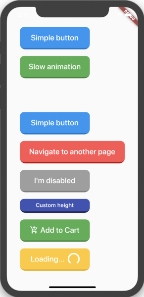

# Flutter Animated Button MOD

A very simple and customizable Animated Button.
Providing simple animation, and many customizable attributes such height, width, child, ... etc.

</br>

 &nbsp;&nbsp;&nbsp;&nbsp;&nbsp; 

</br>

## Simple Example

```dart
import 'package:flutter_animated_button_mod/flutter_animated_button_mod.dart';
import 'package:flutter/material.dart';

void main() => runApp(MyApp());

class MyApp extends StatelessWidget {
  @override
  Widget build(BuildContext context) {
  return MaterialApp(
    title: 'Animated Button Demo',
    theme: ThemeData(
        primarySwatch: Colors.blue,
    ),
    home: Demo(),
    );
  }
}

class Demo extends StatelessWidget {
  @override
  Widget build(BuildContext context) {
  return Scaffold(
    body: Center(
      child: AnimatedButton(
          child: Text(
                'Simple button',
                style: TextStyle(
                fontSize: 22,
                color: Colors.white,
                fontWeight: FontWeight.w500,
                ),
           ),
          onPressed: () {},
          ),
      ),
    );
  }
}
```

</br>

## Button attributes

```dart
AnimatedButton(
  child: ...,			// Child widget, Row, Text, Column,...etc.
  onPressed: () {},  	// Callback for onTap event
  duration: 70,  		// Animaton duration, default is 70 Milliseconds
  height: 100,  		// Button Height, default is 64
  width: 200,  			// Button width, default is 200
  enabled: true,  		// When disabled, onTap won't be called
  // Shadow color is generated from button color,
  // here you have the option to make it darker
  // for lighter colors such white!
  shadowDegree: ShadowDegree.dark,
  color: Colors.blue,
)
```

</br>

### For more examples, check example folder

</br>

## License
MIT License.